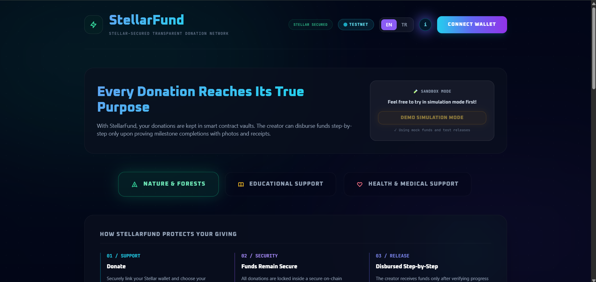
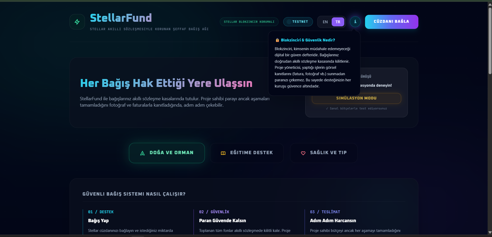
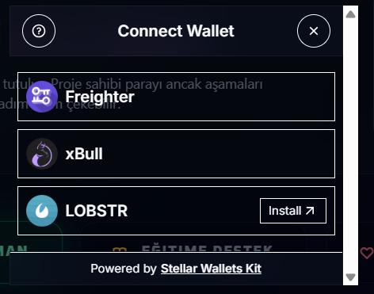
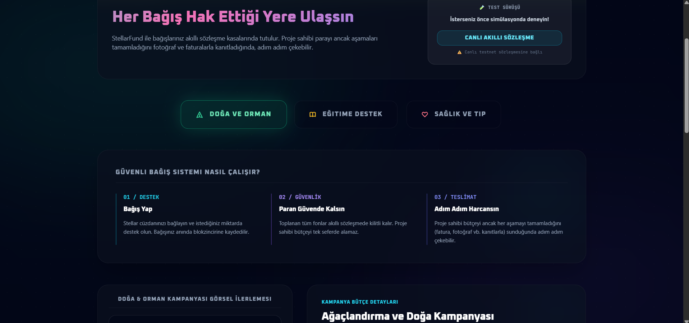
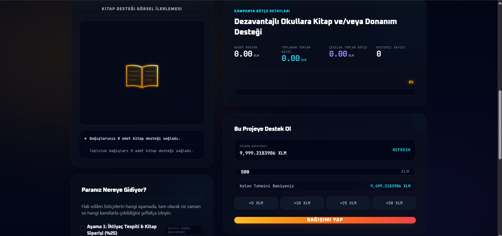
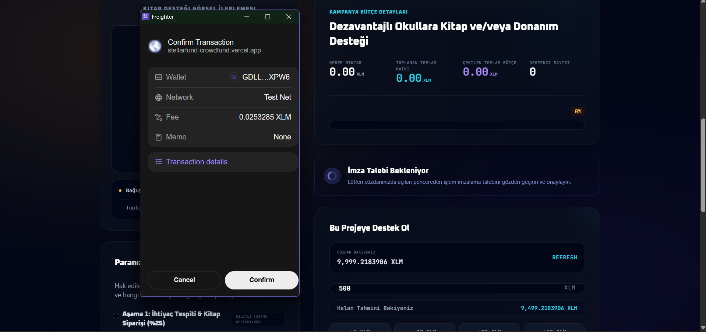
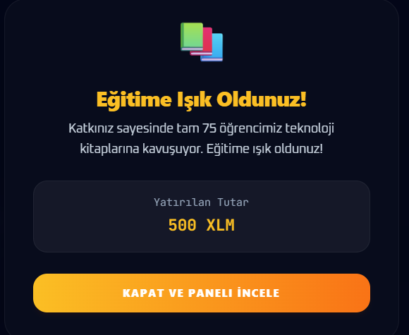
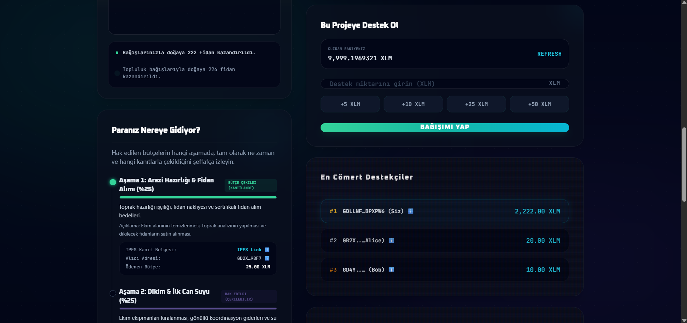
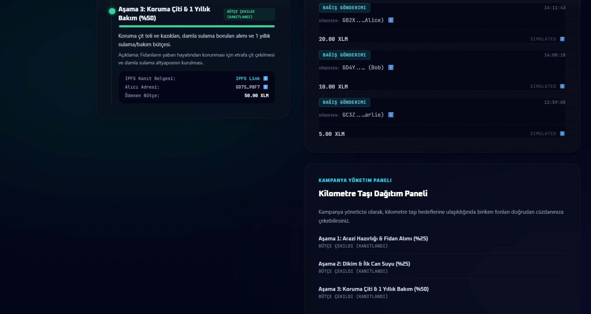
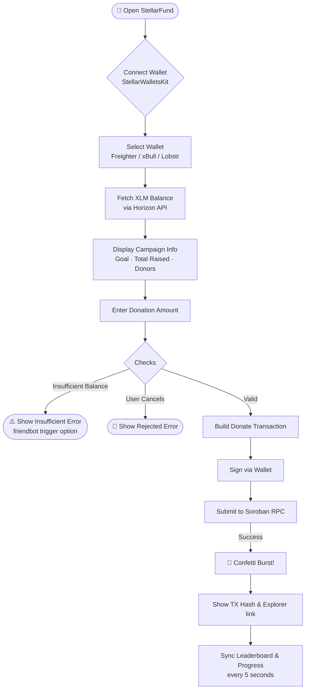

# StellarFund — Transparent Crowdfunding dApp on Stellar Testnet

> **TR:** Stellar Sarı Kuşak (Yellow Belt) projesi — Soroban akıllı sözleşmesi ve çoklu cüzdan desteği ile interaktif kitlesel fonlama uygulaması.

StellarFund is a design-first crowdfunding dApp on Stellar Testnet. Campaign progress is visualized not with standard cards, but as animated SVG monitors and a glowing milestone journey. Users connect multiple wallets (Freighter, xBull, Lobstr) to donate XLM on-chain, with every transaction locked in a Soroban smart contract.

---

## 🌐 Live Demo

**[https://stellarfund-crowdfund.vercel.app/fund](https://stellarfund-crowdfund.vercel.app/fund)**

> **TR:** Vercel üzerinde canlı çalışan testnet arayüzü.

---

## 📸 Screenshots

### Hero — Main Interface (EN / TR)

| English | Turkish |
|---|---|
|  |  |

### Multi-Wallet Connection (StellarWalletsKit)

> **TR:** Freighter, xBull ve Lobstr cüzdanlarını tek modal üzerinden bağlama ekranı.

### Campaign Tabs & How It Works Section

> **TR:** 3 kampanya kategorisi (Doğa, Eğitim, Sağlık) ve güvenli bağış sistemi açıklama paneli.

### Donation Panel — Connected Wallet with Balance

> **TR:** Bağlı cüzdan bakiyesi, hızlı tutar butonları (+5, +10, +25, +50 XLM) ve bağış formu.

### Freighter Transaction Signing

> **TR:** Freighter cüzdanından işlem imzalama adımı — testnet ağında gerçek on-chain işlem.

### Success Overlay (Victory Screen)

> **TR:** Başarılı bağış sonrası animasyonlu kutlama ekranı.

### Leaderboard & Real-Time Donor Stats

> **TR:** En cömert destekçiler sıralaması, biriken bağış sayaçları ve canlı bakiye.

### Milestone Tracker & Live Activity Feed

> **TR:** Akıllı sözleşme aşama takibi (IPFS kanıtlı bütçe çekimleri) ve canlı işlem akışı.

---

## 🔄 User Workflow

> **TR:** Kullanıcı bağış işlem akış şeması.

---

## ✨ Features

- **Multi-Wallet Integration** — Toggle connection modals via `StellarWalletsKit` supporting **Freighter**, **xBull**, and **LOBSTR** in a single click.
- **Animated SVG Progress Monitors** — Three category-specific monitors (tree, book, heartbeat) animate in real-time as donations accumulate.
- **On-Chain Leaderboard** — Ranks the top 3 contributors stored inside the Soroban Rust contract.
- **Live Activity Feed** — Polls Horizon API every 5 seconds for the latest transaction hashes and donor details.
- **Milestone Withdrawals (`claim_milestone`)** — Campaign owner can claim funds only after verifying milestone completions with IPFS proof links.
- **Sandbox / Demo Mode** — Fully interactive simulation without a wallet, using mock funds — great for exploring the UX.
- **Bilingual UI (EN/TR)** — Full language toggle with localized copy throughout.
- **Comprehensive Error Handling** — Guides users through `wallet_not_found` (with download links), `user_rejected`, and `insufficient_balance` (with Friendbot faucet button).

> **TR Özet:** Çoklu cüzdan, animasyonlu SVG monitörler, liderlik tablosu, canlı işlem akışı, aşamalı bütçe çekme, demo modu, EN/TR dil desteği ve 3 tip hata yönetimi.

---

## 🛠️ Tech Stack

| Layer | Technology |
|---|---|
| Smart Contract | Soroban SDK (Rust, v26) |
| Frontend | Next.js 14 + TypeScript |
| Styling | Tailwind CSS |
| Wallet | `@creit-tech/stellar-wallets-kit` |
| Stellar SDK | `@stellar/stellar-sdk` |
| CLI | Stellar CLI (v27) |
| Deployment | Vercel |

> **TR:** Akıllı sözleşme Rust/Soroban, arayüz Next.js 14 + TypeScript + Tailwind CSS, cüzdan entegrasyonu `@creit-tech/stellar-wallets-kit` ile yapılmıştır.

---

## 🔗 On-Chain Contract

- **Contract ID:** `CCNY74O274PDPMGDS2PU34SYQMIYQWZYCUE4WNM6L4B6AQMXGWXCRIFY`
- **Stellar Expert:** [View Contract](https://stellar.expert/explorer/testnet/contract/CCNY74O274PDPMGDS2PU34SYQMIYQWZYCUE4WNM6L4B6AQMXGWXCRIFY)
- **Initial TX:** [`1864ad3f...`](https://stellar.expert/explorer/testnet/tx/1864ad3f893eff3bcd572e53f081ccfb9233911c9295c14153cbc2084488e145)

> **TR:** Testnet akıllı sözleşme adresi ve başlatma işlem hash'i.

---

## ✅ Yellow Belt Checklist

- [x] StellarWalletsKit multi-wallet (Freighter, xBull, Lobstr)
- [x] 3 error types handled (Not found, Rejected, Insufficient balance)
- [x] Contract deployed on testnet
- [x] Contract called from frontend
- [x] Transaction status visible (pending / success / fail)
- [x] Deployed contract address & TX hash in README
- [x] Live demo link (Vercel)
- [x] Screenshots of wallet connection and UI
- [x] Public GitHub repository → https://github.com/deniznizam/stellarfund-crowdfund

---

## License

MIT
